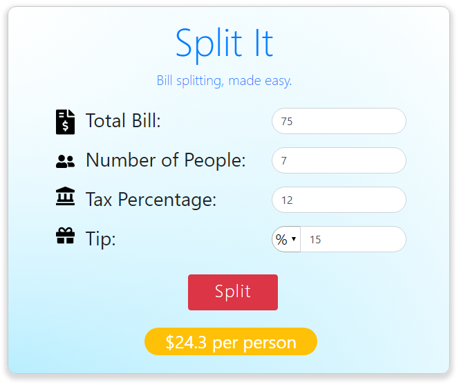

# Split It

*A bill splitting web app using PHP back-end with HTML, CSS and Bootstrap front-end using responsive web design. Designed and implemented with modern UI and UX in mind along with form handling and validation.*

## Running the app:
    php -S localhost:3000